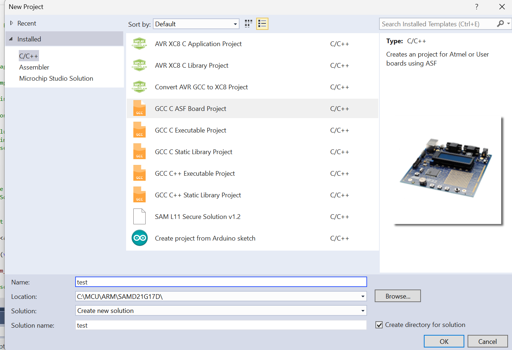
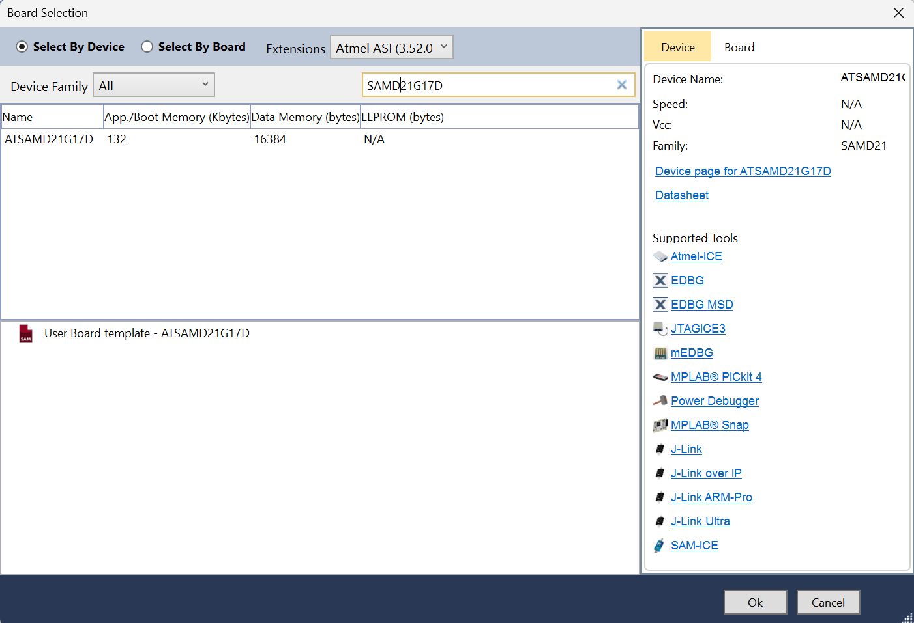
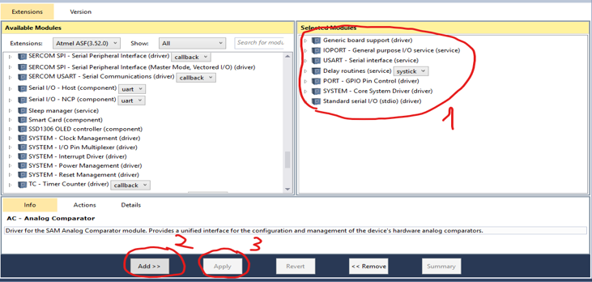
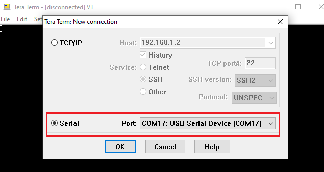

# Samd21-with-DHT11
 this github will guide how to connect SAMD21G17D with DHT11
 thực hiện trên kit 

## Cách hoạt động của DHT11

1. **MCU gửi tín hiệu Start** đến DHT11 (từ PA21 → Data pin)
   - Cấu hình PA21 là **Output**, kéo chân Data xuống mức thấp trong **20 ms**  
   - Sau đó nhả chân Data về mức cao trong **40 µs**

2. **DHT11 gửi tín hiệu Response** (Data pin → PA21)
   - Cấu hình PA21 là **Input**, chờ tín hiệu bắt đầu  
   - DHT11 kéo chân Data xuống mức thấp trong **80 µs**  
   - Sau đó nhả chân Data về mức cao trong **80 µs**

3. **Truyền dữ liệu (40 bit)** (Data pin → PA21)
   - **16 bit**: Độ ẩm  
   - **16 bit**: Nhiệt độ  
   - **8 bit**: Checksum (để kiểm tra tính toàn vẹn dữ liệu)


## Bước 1 : set up với mircrochip studio

* kết nối với board
* ấn vào file -> project -> GCC C ASF Board Project
  * đổi tên ở name 
  * đổi địa chỉ file ở local
    

 
* chọn Board SAMD21G17D

* ấn ok thì ta sẽ có 1 project

## bước 2 : set up asf

* chọn những thư viện asf mà ta dùng để có thể sử dụng cho samd21
* ấn vào ASF -> chọn ASF Wizard -> add các modules sau
  * **GENERIC BOARD SUPPORT**: Hỗ trợ cơ bản cho board SAMD21, khởi tạo phần cứng.
  * **IOPORT - GENERAL PURPOSE I/O SERVICE**: Điều khiển chân I/O cho giao tiếp ngoại vi.
  * **USART - SERIAL INTERFACE**: Giao tiếp UART để gửi/nhận dữ liệu nối tiếp.
  * **DELAY ROUTINES**: Tạo độ trễ chính xác bằng SysTick.
  * **PORT - GPIO PIN CONTROL**: Quản lý chi tiết chân GPIO ở mức phần cứng.
  * **SYSTEM - CORE SYSTEM DRIVER**: Khởi tạo và quản lý hệ thống, clock, nguồn.
  * **STANDARD SERIAL I/O (STDIO)**: In/nhận dữ liệu qua UART bằng printf, scanf.


## bước 3 : viết hàm cho USART để debug

**Chân kết nối:**  
- PA22 → TX (SERCOM5 PAD0)  
- PB22 → RX (SERCOM5 PAD2)

### 3.1. Hàm configure cho USART
```c
void configure_usart(void)
{
    struct usart_config config_usart;
    usart_get_config_defaults(&config_usart);

    config_usart.baudrate    = 9600;                          // Tốc độ baud 9600
    config_usart.pinmux_pad0 = PINMUX_PA22D_SERCOM5_PAD0;     // PA22 TX
    config_usart.pinmux_pad1 = PINMUX_UNUSED;
    config_usart.pinmux_pad2 = PINMUX_PB22D_SERCOM5_PAD2;     // PB22 RX
    config_usart.pinmux_pad3 = PINMUX_UNUSED;

    // Khởi tạo USART và bật module
    while (usart_init(&usart_instance, SERCOM5, &config_usart) != STATUS_OK) { }
    usart_enable(&usart_instance);
}
```

### 3.2. Hàm gửi 1 ký tự qua USART
```c
void usart_putc(char ch)
{
    // Viết 1 byte (ký tự) vào buffer và chờ gửi xong
    usart_write_buffer_wait(&usart_instance, (uint8_t *)&ch, 1);
}
```

### 3.3. Hàm gửi 1 chuỗi ký tự qua USART
```c
void usart_print(const char *str)
{
    for (int i = 0; str[i] != '\0'; i++) {
        usart_putc(str[i]);
    }
}
```


## bước 4 : viết hàm lấy dữ liệu từ DHT11

### 4.1. Hàm `Start()` (MCU → DHT11)
```c
void Start(void)
{
    // Output, PA21
    PORT->Group[0].DIR.reg  |=  (1 << DHT11_pin);
    // Kéo low trong 20 ms
    PORT->Group[0].OUT.reg  &= ~(1 << DHT11_pin);
    delay_ms(20);

    // Nhả high trong 40 µs
    PORT->Group[0].OUT.reg  |=  (1 << DHT11_pin);
    delay_us(40);
}
```

### 4.2. Hàm `Response()` (DHT11 → MCU)
```c
void Response(void)
{
    // Input, bật pull‑up
    PORT->Group[0].DIR.reg       &= ~(1 << DHT11_pin);
    PORT->Group[0].PINCFG[DHT11_pin].reg |= PORT_PINCFG_PULLEN;
    PORT->Group[0].OUT.reg       |=  (1 << DHT11_pin);

    // Chờ DHT11 kéo low → high → low
    while (!(PORT->Group[0].IN.reg & (1 << DHT11_pin)));  // chờ low
    while  ( PORT->Group[0].IN.reg & (1 << DHT11_pin));   // chờ high
    while (!(PORT->Group[0].IN.reg & (1 << DHT11_pin)));  // chờ low
}
```

### 4.3. Hàm `Receive_data()` (đọc 8 bit)
```c
uint8_t Receive_data(void)
{
    uint8_t c = 0;
    for (int q = 0; q < 8; q++)
    {
        // Chờ bắt đầu bit (low→high)
        while (!(PORT->Group[0].IN.reg & (1 << DHT11_pin)));
        delay_us(30);

        // Nếu vẫn high → 1, ngược lại → 0
        if (PORT->Group[0].IN.reg & (1 << DHT11_pin))
            c = (c << 1) | 0x01;
        else
            c = (c << 1);

        // Chờ DHT11 kéo low kết thúc bit
        while (PORT->Group[0].IN.reg & (1 << DHT11_pin));
    }
    return c;
}
```

## bước 5 : kết nối với Tera Term để hiện thị qua cổng COM
* mở Tera Term


* chọn Serial Port
  
* chuyển qua baud rate là 9600
  
* có thể thấy chữ xuất hiện ở terminal


