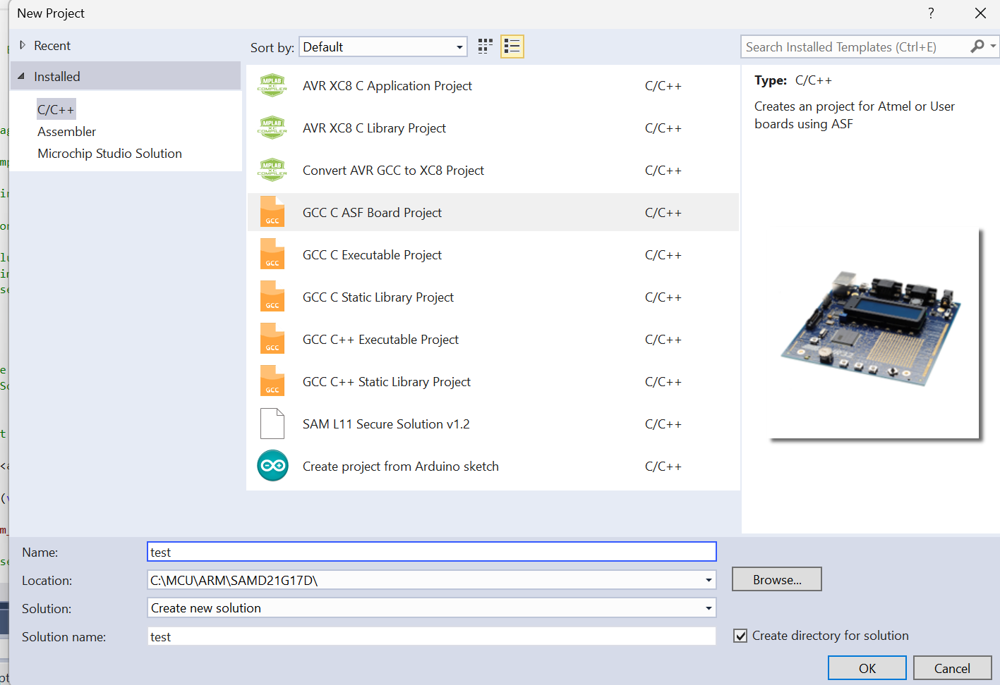

# Samd21-with-DHT11
 this github will guide how to connect SAMD21G17D with DHT11

## Bước 1 : set up với mircrochip studio
* kết nối với board
* ấn vào file -> project -> GCC C ASF Board Project
  * đổi tên ở name 
  * đổi địa chỉ file ở local

 
* chọn Board SAMD21G17D
* ấn ok thì ta sẽ có 1 project

## bước 2 : set up asf

## bước 3 : viết hàm cho USART để debug

## bước 4 : viết hàm lấy dữ liệu từ DHT11

## bước 5 : kết nối với Tera Term để hiện thị qua cổng COM
